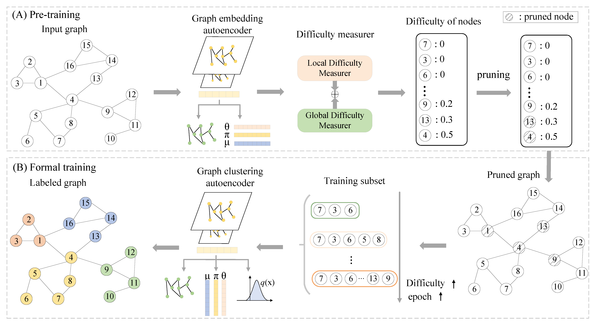

# scCLG: Single-cell Curriculum Learning-based Deep Graph Embedding Clustering

The swift advancement of single-cell RNA sequencing (scRNA-seq) technologies enables the investigation of cellular-level tissue heterogeneity. Cell annotation significantly contributes to the extensive downstream analysis of scRNA-seq data. However, The analysis of scRNA-seq for biological inference presents challenges owing to its intricate and indeterminate data distribution, characterized by a substantial volume and a high frequency of dropout events. Furthermore, the quality of training samples varies greatly, and the performance of the popular scRNA-seq data clustering solution GNN could be harmed by two types of low-quality training nodes: 1) nodes on the boundary; 2) nodes that contribute little additional information to the graph. To address these problems, we propose a single-cell curriculum learning-based deep graph embedding clustering (scCLG). We first propose a Chebyshev graph convolutional autoencoder with multi-criteria (ChebAE) that combines three optimization objectives, including topology reconstruction loss of cell graphs, zero-inflated negative binomial (ZINB) loss, and clustering loss, to learn cell-cell topology representation. Meanwhile, we employ a selective training strategy to train GNN based on the features and entropy of nodes and prune the difficult nodes based on the difficulty scores to keep the high-quality graph. Empirical results on a variety of gene expression datasets show that our model outperforms state-of-the-art methods. The code of scCLG will be made publicly available at [https://github.com/LFD-byte/scCLG](https://github.com/LFD-byte/scCLG).



## Installation

### create conda environment

`conda create -n scclg python=3.7.4`

### install requirements

```
conda activate scclg
pip install -r requirements
```

## Project structure

```
+--data
|      +--Muraro
|      |      +--data.h5
+--data_dropouted
|      +--Muraro_sorted_trainset_300_gpu.txt
+--figures
|      +--framework.pdf
|      +--framework.png
+--utils
|      +--early_stop.py
|      +--graph_function.py
|      +--layers.py
|      +--loss.py
|      +--preprocess.py
|      +--preprocess_cl.py
|      +--preprocess_order.py
|      +--SingleCell.py
|      +--utils.py
|      +--util_clnode.py
+--wandb
+--LICENSE
+--README.md
+--sccheb.py
+--sccheb_cl.py
+--train.sh
+--train_cl.py
```

## Usage

You can run the DP-DCAN from the command line:
```
python train_cl.py --is_cl --expname CL --dataname Muraro --highly_genes 500 --pretrain_epochs 1000 \
        --maxiter 500 --prune_epoch 30 --k 20
```